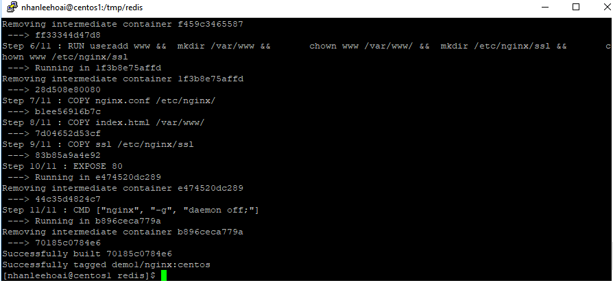
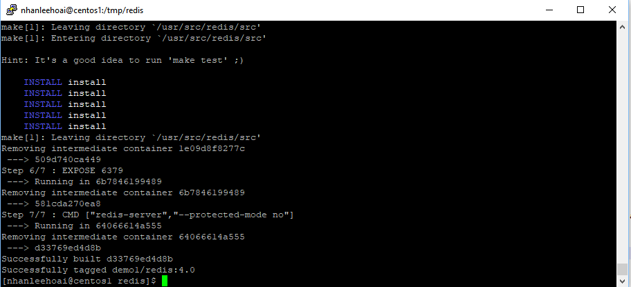
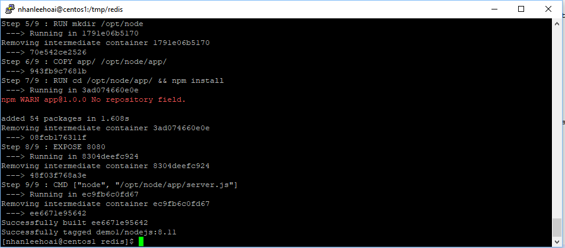
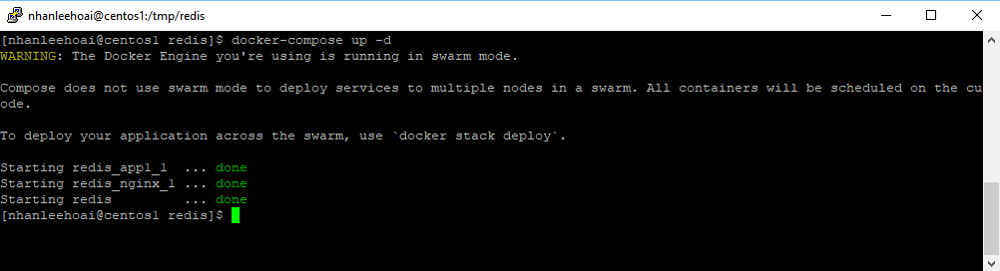
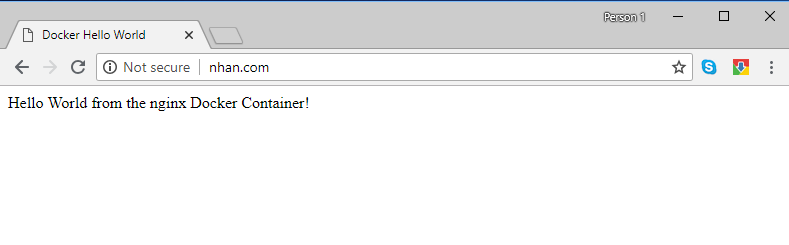
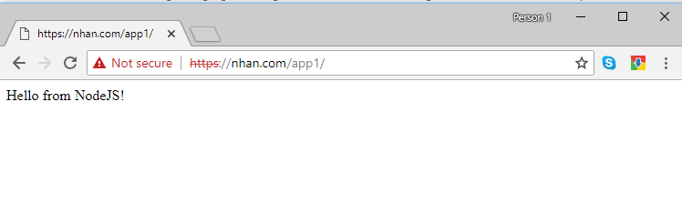
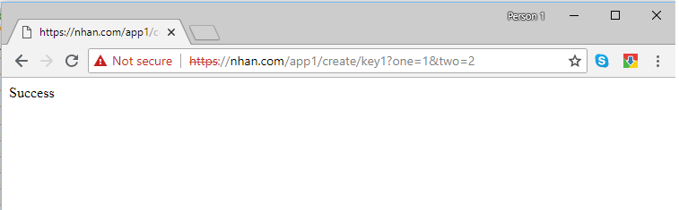
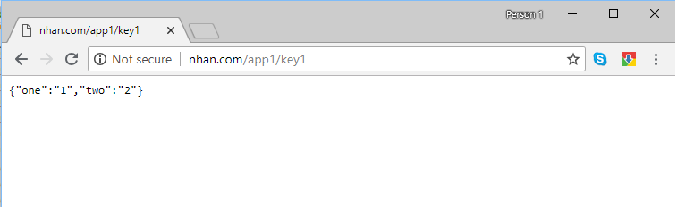

## Use Redis on NodeJs as Cache

Redis is argually a fatest IMDB (In Memory DataBase) it is most commonly used as a cache engine.

NodeJS has gained popularity and bacome ubiquitous

In this demo, I'll show the steps to build 3 Docker images: Nginx, Redis, and NodeJs


### Prerequisite

- A Centos 7 server installed with Docker CE and docker-compose
- Basic knowlege of Docker and docker-compose. 

### Build the three docker images

- Copy the docker folder to a temporary folder on Centos 7 server

- Build the Docker image which has Nginx and tag it as "demo1/nginx:centos"

```
 docker build --force-rm -t demo1/nginx:centos -f Dockerfile-nginx .
```



- Build the Docker image which has Redis and tag it as "demo1/redis:4.0". At the time of this writing, the latest Redis stable version is 4.0
Redis has EPEL repository on Centos so that we can install using "yum" however, it is quite an old version. 
To have a latest Redis version, we need to down the source code and build it by "make" command

```
 docker build --force-rm -t demo1/redis:4.0 -f Dockerfile-redis .
```



- Build the Docker image which has NodeJs, and tag it as "demo1/nodejs:8.11". Then deploy a simple app "server.js" that uses Redis as a cache

```
  docker build --no-cache --force-rm -t demo1/nodejs:8.11  -f Dockerfile-nodejs .

```



Now let check the three images have been succesfully built by using the command

```
docker images
```

### Start the application by Docker-Compose

```
	docker-compose up -d
```
Note that "-d" argument above mean detache. If you want to see the console log (or any error), just remove "-d", docker-compose will attach the 3 containers with console




### Test the result



```
	https://nhan.com/app1/
```


Now let create a new key 
```
	https://nhan.com/app1/create/key1?one=1&two=2
```



And query the cache on redis
```
	https://nhan.com/app1/key1
```



Tha


